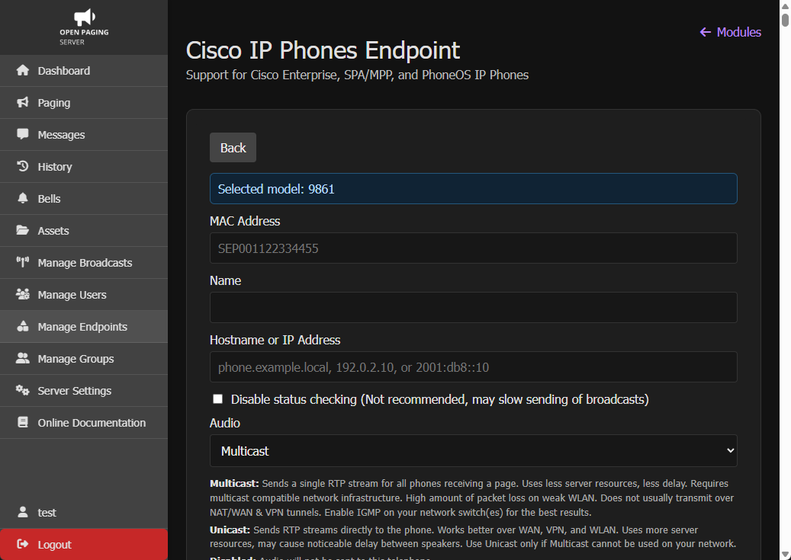

# Manually adding phones

Once you completed the [prerequisites](prerequisites.md), you can now start adding your phones into Open Paging Server.

To add Cisco IP Phones manually to Open Paging Server, you'll need their hostname or IP address. It's recommended to use a hostname since otherwise you'll need to change the IP address every time the telephone gets a new IP address from your DHCP server.

Go to `Manage Endpoints`, `+`, `Cisco IP Phones`, `Cisco Enterprise (SEP)`.

Select the model. This should be accurate, otherwise, certain features may not work properly.

In `MAC Address`, enter the full 12 digit MAC address starting with SEP.

In `Name`, enter a name which will be used to identify the device.

In `Hostname or IP Address` (or `IPv4 Address`), enter the hostname or IP address of the telephone.

If you select `Disable status checking` (or `Do not check status of device`), the status of the device will not be checked in the background. Open Paging Server will always attempt to send messages to this device even it it's offline or unable to receive messages. Disabling checking of status is not recommended unless you have **VERY** little resources because Open Paging Server won't start a broadcast until all devices are ready. If tons of unchecked devices are offline, it can delay a critical message for online devices by up to 5-15 seconds. As such, Leaving checking enabled ensures that broadcasts can be sent reliably.

For `Audio`, select Multicast if possible. Otherwise, select Unicast if Multicast **CANNOT** be used on your network.

>**Multicast:** Sends a single RTP stream for all phones receiving a page. Uses less server resources, less delay. Requires multicast compatible network infrastructure. High amount of packet loss on weak WLAN. Does not usually transmit over NAT/WAN & VPN tunnels. Enable IGMP on your network switch(es) for the best results.
  **Unicast:** Sends RTP streams directly to the phone. Works better over WAN, VPN, and WLAN. Uses more server resources, may cause noticeable delay between speakers. Use Unicast only if Multicast cannot be used on your network.
  **Disabled:** Audio will not be sent to this telephone.

For `Visual`, you can select either Image, Text, or None.

>**Image**:
>The short message is displayed on a colored background. If the message as an icon, it will also be shown. You can view the long message using the `Details` softkey. On the details page, press `Info` to view message metadata (such as sender, time sent and of expiration, and product name). This mode makes it easy to read the screen from a distance. (Uses `CiscoIPPhoneImage` )
>**Text**: 
>In text mode, both the short and long messages are visible on the screen. (Short message won't be shown if the long message matches the short message or contains it). There is no color, or icon. This is the only supported mode on the 7800 series, 8831, 8832, and 9831.  Press `Info` to view message metadata (such as sender, time sent and of expiration, and product name). This mode makes it easy to read the screen from a distance This mode is not recommended if the message needs to be visible from a distance. 
>
>
>
>
>**None**: No visual message with be displayed on this telephone.

In `Volume`, you can force the phone to play broadcasts at a certain volume. If volume in a message is set, that will override this value.

When you are done, click, `Add Cisco Enterprise Endpoint`. The phone will now appear in the endpoints list and the status should update within a few seconds. If does not update, try reloading or restarting the server or module.