# Connecting to Cisco Unified Communications Manager

If you are using Cisco Unified Communications Manager, you can connect Open Paging Server so that your phones and their IP addresses sync automatically using AXL. We will also cover how to add a SIP trunk so that you can dial into Open Paging Server from Cisco Unified Communications Manager for paging or sending messages.

If you are not using Cisco Unified Communications Manager, you can skip this step. 

Before continuing, ensure that you completed the [[prerequisites]].

## Step 1: Enable Cisco AXL Web Service

If you have not already, you will need to enable the Cisco AXL Web Service.

Go to `Cisco Unified Serviceability` > `Tools` > `Service Activation`. Select your publisher. If you want Open Paging Server to also sync from your subscriber(s) if the publisher is down, you can enable the Cisco AXL Web Service for those too.

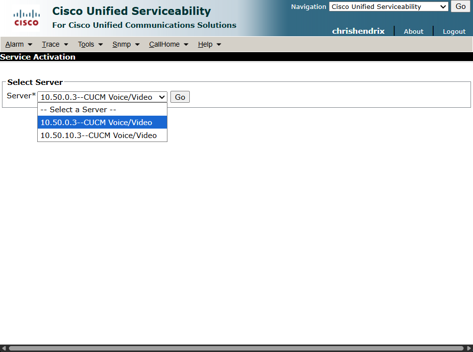

Under `Database and Admin Services`, check `Cisco AXL Web Service`, and click `Save`. Repeat this process for all subscribers.

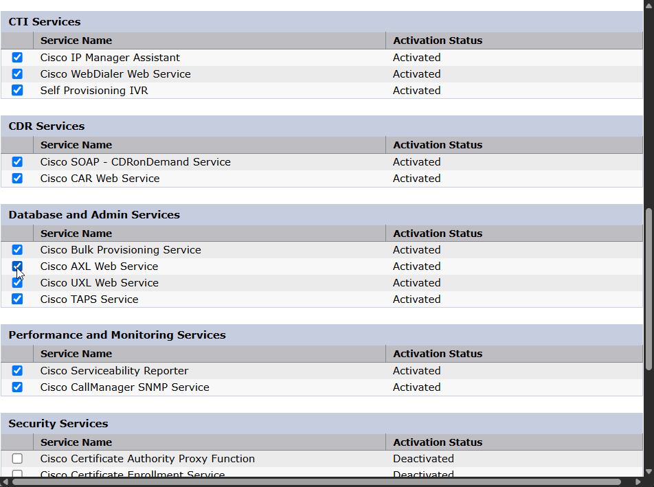

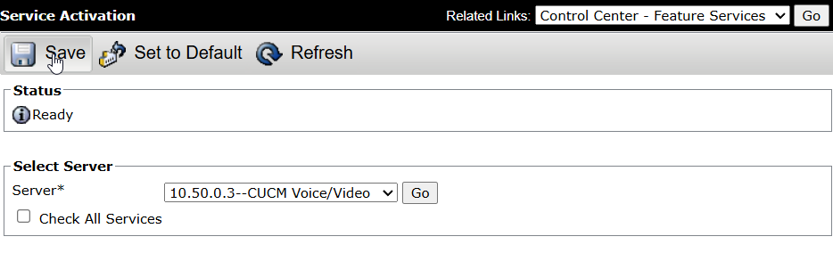

The service should start automatically, however to check, go to `Cisco Unified Serviceability` > `Tools` > `Control Center - Feature Services`. And ensure that the service is running.

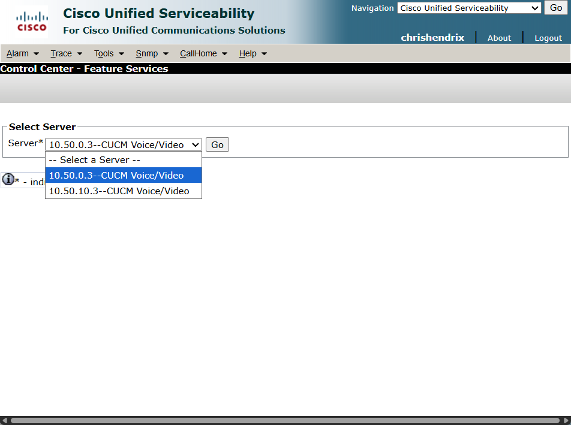

Under `Database and Admin Services`, select `Cisco AXL Web Service` and click `Start` if it's not showing as `Activated`.

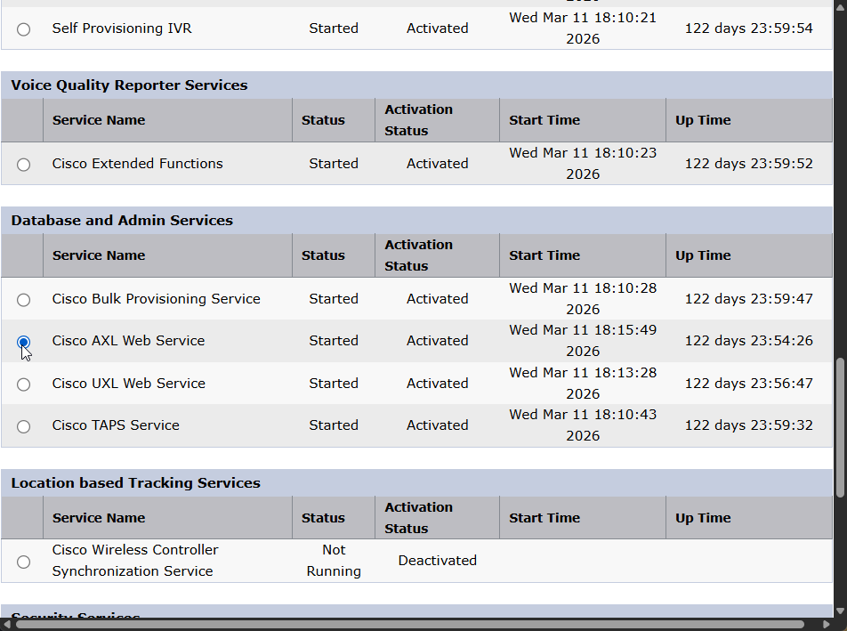

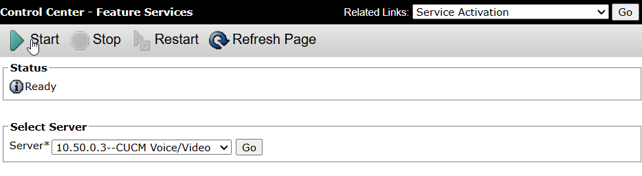

## Step 2: Create Application User

Go to `Cisco Unified CM Administration` > `User Management` > `Application Users` and click `Add New`.

Create a new `User ID`, and choose a password which will go under both `Password`, and `Digest Credentials`. You will need to use these credentials to connect Open Paging Server to CUCM

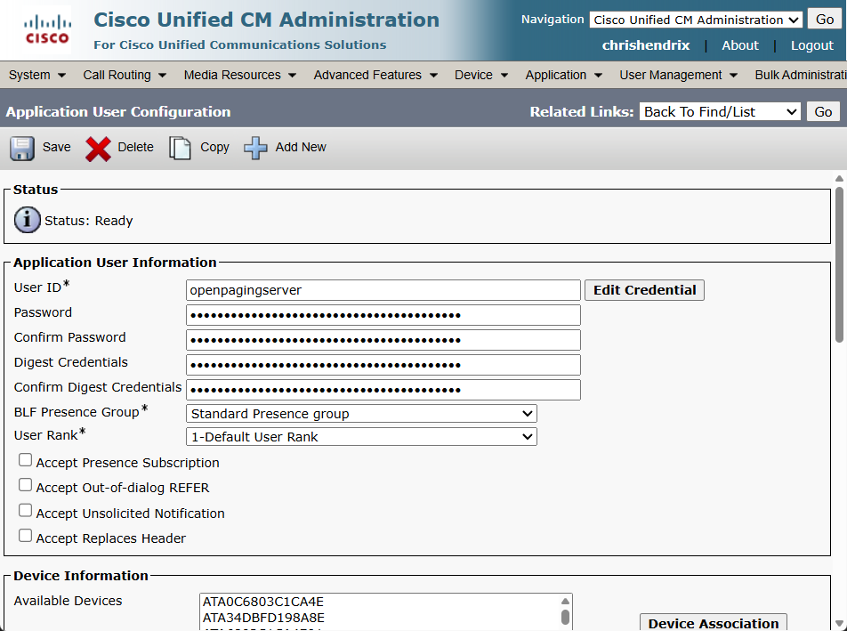

**You don't need to assign any devices under `Device Information.`** Open Paging Server does not need to control your devices through CUCM. However, as we mentioned earlier in the documentation, we are researching different ways of sending broadcasts to phones, and this may be one of them in the future. But you can always assign phones in the future if this is ever used.

Under `Permissions Information`, click `Add to Access Control Groups`, select `Standard CCM Phone Administration` and click `Add Selected`

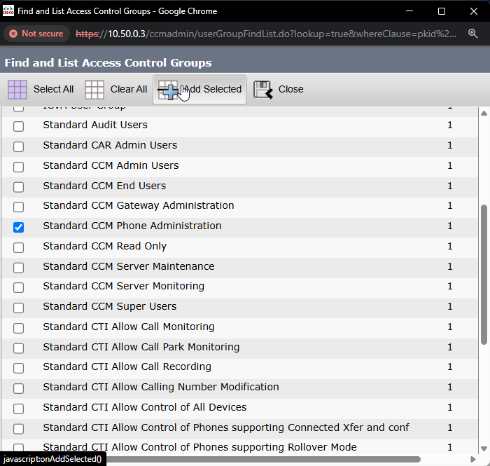

Review the new Application User you created, and click `Save`.

## Step 3: Connect Open Paging Server to CUCM

In Open Paging Server, go to `Manage Endpoints`,  `Manage Endpoint Modules`, and click `Module Settings` for `Cisco IP Phones`. 

Enable `Sync with Unified Communications Manager (CUCM)`. In `CUCM Server(s)`, enter the IP address of your publisher followed by any subscribers separated by commas. Enter the User ID in `Application User ID` and password in `Application User Password`. You can adjust the `CUCM Sync Interval`, then click `Save Cisco Settings`. 

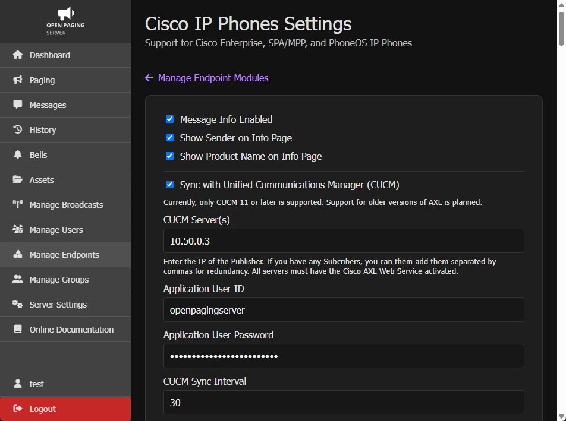

Now click `Save Cisco Settings`

Your phones should soon auto-populate in `Manage Endpoints`. If it's been at least twice as long as the sync interval and they still don't show up, check your configuration for any errorss.

## Step 4: Adding a SIP trunk

Now that Cisco Unified Communications Manager phones are synced with Open Paging Server, we can add a SIP trunk which will let us access Dial Plan Extensions on Open Paging Server from CUCM. Dial plan extensions let you send pages or messages right from your telephone by dialing a number. We will only cover adding the SIP trunk. You can learn more in Administration > Endpoints > SIP Trunks > Dial Plan Extensions.

When adding your CUCM servers, you may have gotten an option to add the servers as a SIP trunk, if you did so, there is no more configuration needed in Open Paging Server.

To add a SIP trunk in Open Paging Server, go to `Manage Endpoints` > `+` > `SIP Trunks`.

You will want to select a `Basic SIP Trunk (IP)`. If you have a SBC or gateway such as CUBE or Asterisk for SIP trunks, you could use a `Inbound-Authenticated SIP Trunk`. However, it's recommend to just trunk CUCM directly. Enter a name and IP Address. Do this for all Unified Call Manager nodes which will be in the Device Pool for Open Paging Server.

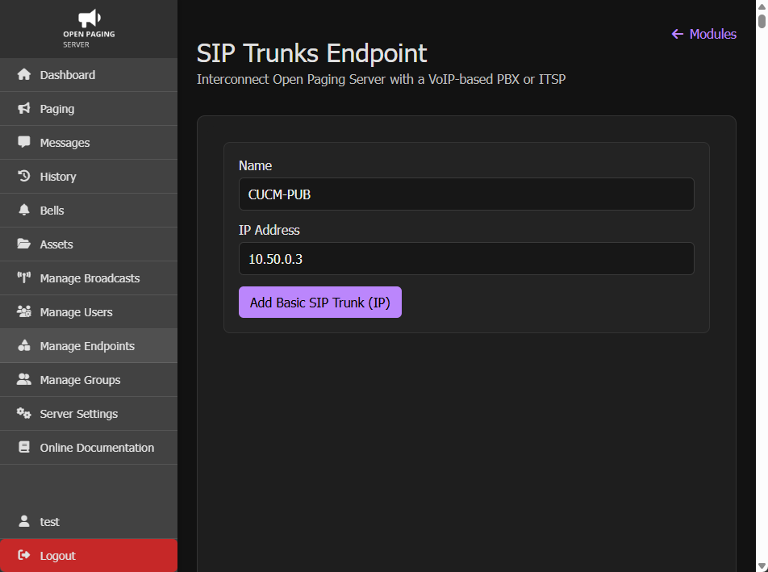

Click `Add Basic SIP Trunk (IP)`

Go to `Cisco Unified CM Administration` > `Device` > `Trunk` > `Add New`.

For `Trunk Type`, select `SIP Trunk`. Then click `Next`.

Enter the a `Device Name`, select your `Device Pool`, `SIP Profile`, and use the default `Non Secure SIP Trunk Profile`. Under `SIP Information`, enter your Open Paging Server's hostname in `Destination Address`. And click `Save`.

<!-- If you are using an Open Paging Server cluster, repeat this process for each node.-->

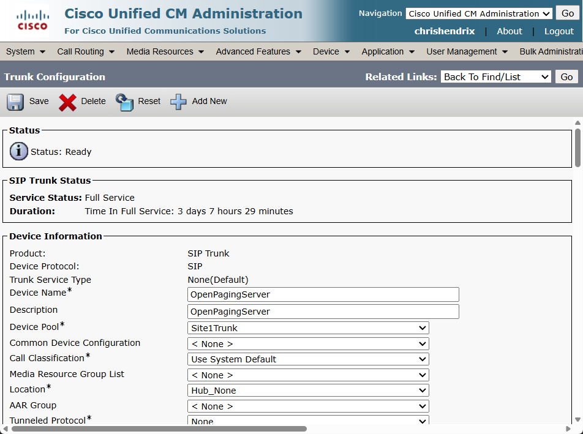
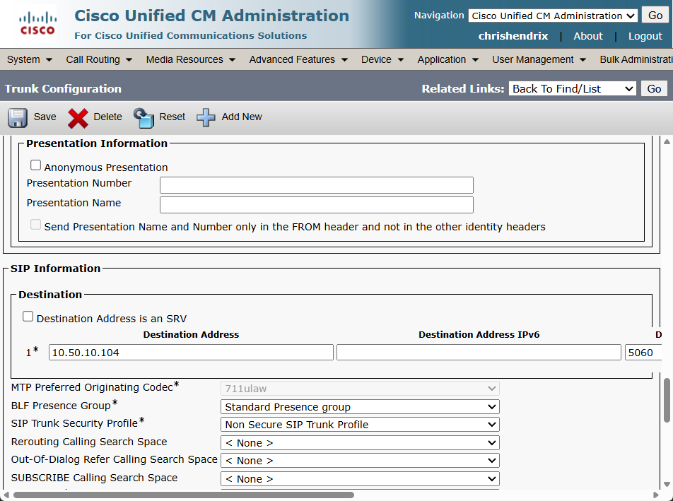

<!-- If you are using a single Open Paging Sever node and not using a cluster, you can skip the next 2 steps. 

If you are using an Open Paging Server cluster, go to `Call Routing > Route/Hunt > Route Group.` Click `Add New` and add all Open Paging Server nodes in your desired order under `Current Route Group Members` and click `Save`. 

Go to `Call Routing > Route/Hunt > Route List`. Click `Add New` and enter a `Name` and a `Cisco Unified Communications Manager Group` and click `Save`. Add the Route Group you just created to `Selected Groups` and click `Save`
-->

Now go to `Call Routing > Route/Hunt > Route Pattern`. Click `Add New`, and add route pattern(s) that match your Dial Plan Extension(s). It could either be wildcards, or one route pattern per extension. Select <!--either-->your Open Paging Server trunk<!-- ,or your route list if using a cluster--> under `Gateway/Route List`, change `Call Classification` to `OnNet` (recommended), and and assign your `Route Partition` based on your call searching spaces. And click `Save`. 

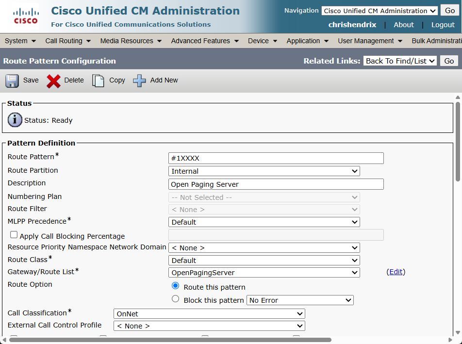

Cisco Unified Communications Manager should now fully connected to Open Paging Server. You are now ready to page and send messages to your Cisco IP Phones.

Learn more on how to:

- Manage phones

- Create groups

- Assign Dial Plan Extensions