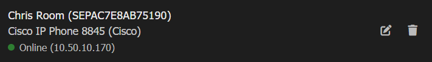
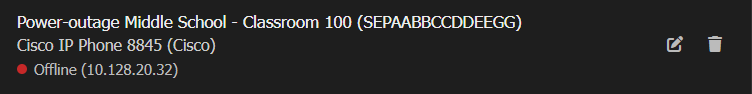
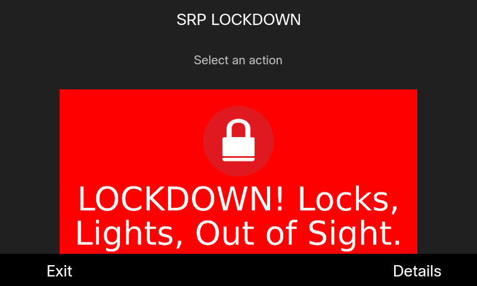
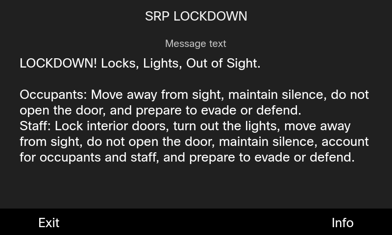
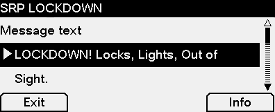

# Managing existing phones

Once you have added a phone in Open Paging Server, you can go to `Manage Endpoints` to view it's status, edit, or delete it.

On the top of the page, you can click `Cisco IP Phones` to only view Cisco IP Phones. 

In list, you'll see your phones displayed along with it's name, MAC address, and IP address. 

`Online` is shown when the phone is fully reachable.

`No Auth URL` shows when there is no authentication URL configured. You should resolve this issue. See [prerequisites](prerequisites.md) for help.

`Offline` shows if the phone is not reachable or Web Access is disabled. If your phone is synced from UCM, it will likely not show an IP address because it's not registered to CUCM. If the phone is synced from UCM, shows an IP address and is offline, either `Web Access` is disabled, or Open Paging Server cannot reach it despite being registered to CUCM.

Click the trash icon to remove the phone. If the phone is synced, this will only hide the phone. You can go to `Manage Endpoint Modules` > `Cisco IP Phones` > `Show hidden synced phones` to unhide hidden phones.

Click the edit icon to manage the phones settings

`Current status` shows the phones status

You'll only ever need to edit `MAC Address` if you enter it wrong the first time.

In `Name`, enter a name which will be used to identify the device.

In `Hostname or IP Address` (or `IPv4 Address`), you can change the hostname of the phone. If the phone is synced with UCM, this will be overwritten.

If you select `Disable status checking` (or `Do not check status of device`), the status of the device will not be checked in the background. Open Paging Server will always attempt to send messages to this device even it it's offline or unable to receive messages. Disabling checking of status is not recommended unless you have **VERY** little resources because Open Paging Server won't start a broadcast until all devices are ready. If tons of unchecked devices are offline, it can delay a critical message for online devices by up to 5-15 seconds. As such, Leaving checking enabled ensures that broadcasts can be sent reliably.

For `Audio`, select Multicast if possible. Otherwise, select Unicast if Multicast **CANNOT** be used on your network.

>**Multicast:** Sends a single RTP stream for all phones receiving a page. Uses less server resources, less delay. Requires multicast compatible network infrastructure. High amount of packet loss on weak WLAN. Does not usually transmit over NAT/WAN & VPN tunnels. Enable IGMP on your network switch(es) for the best results.
  **Unicast:** Sends RTP streams directly to the phone. Works better over WAN, VPN, and WLAN. Uses more server resources, may cause noticeable delay between speakers. Use Unicast only if Multicast cannot be used on your network.
  **Disabled:** Audio will not be sent to this telephone.

For `Visual`, you can select either Image, Text, or None.

>**Image**:
>The short message is displayed on a colored background. If the message as an icon, it will also be shown. You can view the long message using the `Details` softkey. On the details page, press `Info` to view message metadata (such as sender, time sent and of expiration, and product name). This mode makes it easy to read the screen from a distance. (Uses `CiscoIPPhoneImage` )
>**Text**: 
>In text mode, both the short and long messages are visible on the screen. (Short message won't be shown if the long message matches the short message or contains it). There is no color, or icon. This is the only supported mode on the 7800 series, 8831, 8832, and 9831.  Press `Info` to view message metadata (such as sender, time sent and of expiration, and product name). This mode makes it easy to read the screen from a distance This mode is not recommended if the message needs to be visible from a distance. 
>
>
>
>
>**None**: No visual message with be displayed on this telephone.

In `Volume`, you can force the phone to play broadcasts at a certain volume. If volume in a message is set, that will override this value.

When you are done, click `Save Cisco Enterprise Endpoint`. The changes are now saved.