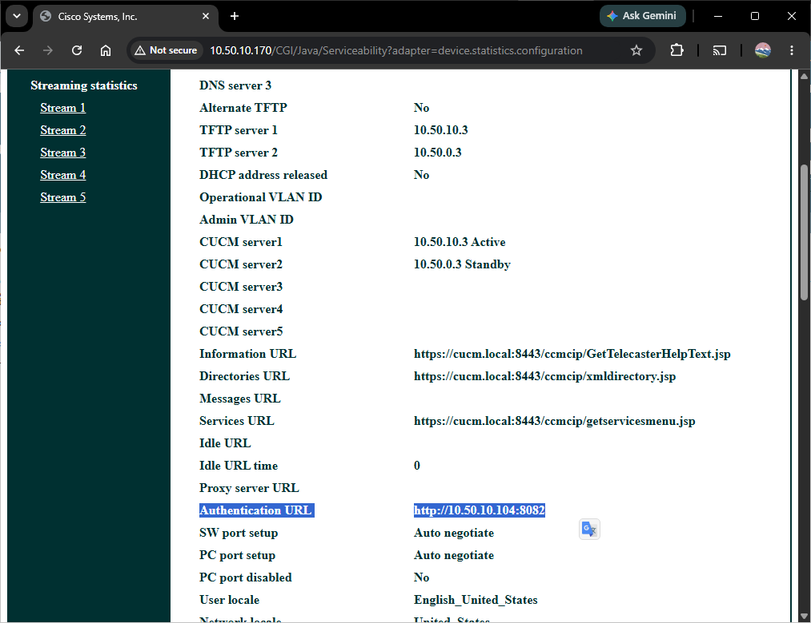

# Pre-requisites

## Network structure

All of the following must be true for Enterprise Cisco IP phones to work on Open Paging Server:

- HTTP of the phones must be reachable from Open Paging Server from Port 80 (Which usually means, no NAT, and Open Paging Server must either be on same VLAN, or be able to reach the phone's VLAN)
- Multicast or Unicast RTP must be able to be sent from Open Paging Server to the phones for audio. (Multicast is recommended when possible. However, Unicast RTP is fully supported)
  
If this is not possible, for example, when using NAT, you cannot currently use the Cisco IP phones module. Instead, you may want to look into the following solutions or alternatives:

- VPN Tunnels: Use VPN tunnels plus Multicast Gateway to bypass NAT all together when possible. You may need a hardware router or PC with an ethernet port to get the telephone on the VPN network.
- Outbound Dial (SIP): Open Paging Server can natively connect to your PBX or call manager over a SIP trunk, which can then call the phone over existing SIP or SCCP which already run through NAT, which sets up NAT punching to then deliver audio via unicast RTP directly the phone either by dialing the phone with a special variable or calling a page group. For example:
	- In CUCM 14 and later, you can set up "Intercom" directory numbers to auto-answer calls. 
	- On chan-sccp, you can set a special context or endpoint for pages that sets the call to auto answer (example: `Dial(SCCP/${NUMBER}/aa=1wb)`)
	- The USECALLMANAGER.nz patch for Asterisk includes a dial plan variable called `CISCO_AUTOANSWER` to sets the call to auto answer.

We are currently researching other ways of sending CGI execute messages, including possibly over SIP or SCCP. However, there is currently no implementation of this currently.
  
## Phone Configuration

In order for CGI execute to work to send messages, you need to configure the following:
  
### Authentication URL

When a Cisco IP phone receives a CGI execute request, it queries a URL along with it's received user name & password, along with the phone's MAC address. The web server will tell the phone whether to accept the request. The Cisco module of Open Paging Server includes an authentication server which for security, generates a one time use username & password. As such the phone must either point to the modules authentication URL, or one which can approve the request to relay it to OPS.

#### If you are not already using other software requiring an authentication URL

Set the authentication URL to `http://{OPSHOSTNAME}:8082`

To do this:

##### In Cisco Unified Commutations Manager (CUCM)

Go to `Cisco Unified CM Administration > System > Enterprise Parameters`

Find `Phone URL Parameters` and under  . You should also check **Secure Phone URL Parameters** and ensure either nothing is there, or an HTTPS URL is there.

You can later set either CUCM's authentication server or another authentication server in Auth Relay in the Cisco endpoint module settings.

##### In Cisco Call Manager Express (CME)

To set the authentication URL for both SIP phones provisioned with `voice register`, and SCCP ephones provisioned with `telephony-service`, use:

```
configure terminal

telephony-service
 authentication credential <app-name> <password>
 url authentication http://<OPS-hostname>:8082 <app-name> <password>
 create cnf-files
 exit

voice register global
 url authentication http://<OPS-hostname>:8082
 no create profile
 create profile
 apply-config
 exit

end
write memory
```

Or if you have an older router that does not support SIP enterprise phones, or don't have any, just use:

```
configure terminal

telephony-service
 service phone webAccess 0
 authentication credential <app-name> <password>
 url authentication http://<OPS-hostname>:8082 <app-name> <password>
 create cnf-files

end
write memory
```

Change `OPS-hostname` as well as the app names and passwords based on your configuration.

You can later set either CME's authentication server or another authentication server in Auth Relay in the Cisco endpoint module settings. 

##### In SCCP Manager (FreePBX)

If you are using SCCP Manager on FreePBX to create configuration files, you can set the authentication URL by going to `Sccp Connectivity > Server Config`. Set `Phone authentication URL ` to `http://<OPSHOSTNAME>:8082`

You can later set another authentication server in Auth Relay in the Cisco endpoint module settings. 
##### Manually (in configuration file)

If you are configuring your configuration files by hand, you can set the parameter `authenticationURL`  under `<device>`. For example:

```
	<authenticationURL>http://<OPS-hostname>:8082</authenticationURL>
```

You can later set another authentication server in Auth Relay in the Cisco endpoint module settings. 

#### If you are already using other software requiring an authentication URL

Most software supports a feature where requests not intended for it can be sent to another authentication URL. It may be called something like `Next Authentication URL`, or `Authentication Relay`. Check with your software vendor or developer for help. If your software does not support it, you'll need to have the authentication chain start at OPS then go to the third-party software.
### Enable Web Access

You'll need to enable web access in order for the phone's web server to start for CGI execute to work. 

##### In Cisco Unified Commutations Manager (CUCM)

Go to `Cisco Unified CM Administration > System > Enterprise Phone Configuration`

Under `Product Specific Configuration Layout`, check `Web Access`, and click `Save`.

##### In Cisco Call Manager Express (CME)

The following will enable Web Access for both SCCP and SIP phones:

```
configure terminal

telephony-service
 service phone webAccess 0
 create cnf-files
 exit

voice register global
 no create profile
 create profile
 apply-config
 exit

end
write memory

```

Or if you have an older router that does not support SIP enterprise phones, or don't have any, just use:

```
configure terminal

telephony-service
 service phone webAccess 0
 create cnf-files

end
write memory
```

##### In SCCP Manager (FreePBX)

If you are using SCCP Manager on FreePBX to create configuration files, you enable Web Access by going to `Sccp Connectivity > Server Config > Advanced SCCP Settings`. Set `Web Access` to `Enabled`

You can later set another authentication server in Auth Relay in the Cisco endpoint module settings. 
##### Manually (in configuration file)

If you are configuring your configuration files by hand, you can set the parameter `webAccess`  under `<vendorConfig>`. `0` enables web access. For example:

```
<vendorConfig>
	<webAccess>0</webAccess>
</vendorconfig>
```

Once this is done, reload or reboot the phone so it can get it's new configuration.
### Testing Settings

If you can reach your phone's VLAN from your PC, you can go to it's web interface at `http://<PHONEIP>`. If web access has been enabled successfully, you should see the phones webpage which will look something like this:

![A screenshot of the Cisco IP Phone's web interface. The screen shows a Cisco web administration page in a desktop web browser. Across the very top is the browser interface with a tab labeled "Cisco Systems, Inc.", an address bar showing a local IP address beginning with **10.50.10.170**, and standard browser buttons. Below that, the page is divided into two main sections. A narrow dark teal navigation panel runs down the entire left side, with the Cisco logo near the top followed by a vertical list of underlined links grouped into categories. The links include **Device information**, **Network setup**, **Network statistics** (with **Ethernet information**, **Access**, and **Network** beneath it), **Device logs** (including **Console logs**, **Core dumps**, **Status messages**, and **Debug display**), and **Streaming statistics** with links for **Stream 1** through **Stream 5**. The much wider right side contains the main content area. At the top is a dark teal banner with a large centered heading reading **"Device information"**, followed by the phone model **Cisco IP Phone CP-8845 (SEPAC7E8AB75190)**. Beneath the banner is a clean two-column table where the left column lists labels such as **Service mode**, **Service state**, **MAC address**, **Host name**, **Phone DN**, **App load ID**, **Boot load ID**, **Version**, **Hardware revision**, **Serial number**, **Model number**, **Message waiting**, **UDI**, **Time**, **Time zone**, and **Date**, while the right column displays their corresponding values, including **On-premise**, **Idle**, the phone's MAC address and hostname, extension **10104**, firmware versions, serial number, model **CP-8845**, **Message waiting: No**, the current time of **2:58:28 PM**, the time zone **America/Los_Angeles**, and the current date. The overall appearance is simple and text-focused, with a white content area, dark teal headers and navigation, black text, and blue underlined navigation links.](CiscoIPPhone-WebInterface.png)

You can also use curl to check if the phone is reachable from the Open Paging Server box itself. 
For example:

```
root@ops-dev:~# curl -L 10.50.10.170
<HTML>
<HEAD><META http-equiv="Content-Type" content="text/html; charset=utf-8"><TITLE>Cisco Systems, Inc.</TITLE>
</HEAD>
<BODY bgcolor="#FFFFFF" link="#FFFFFF" vlink="#FFFFFF" alink="#FFFFFF" text="#003031" ><TABLE BORDER="1" WIDTH="100%" HEIGHT="100%" CELLSPACING="0" CELLPADDING="0" bordercolor="#003031"><TR>
<td WIDTH="200" HEIGHT="100" ALIGN=center><A HREF="http://www.cisco.com"></A></TD><td HEIGHT="50" bgcolor="#003031"><p ALIGN=center style="margin-top: 0px;"><B><font color="#FFFFFF" size="6">Device information</FONT></B><p ALIGN=center><B><font color="#FFFFFF" size="4">Cisco IP Phone CP-8845 ( SEPAC7E8AB75190 )</FONT></FONT></B></TD>
</TR>
<TR><td WIDTH="200" ALIGN=center VALIGN=top bgcolor="#003031"><TABLE BORDER="0" CELLSPACING="10" CELLPADDING="0"><TR>
<TD><a href="/CGI/Java/Serviceability?adapter=device.statistics.device">Device information</A></TD></TR>
<TR>
<TD><a href="/CGI/Java/Serviceability?adapter=device.statistics.configuration">Network setup</A></TD></TR>
<TR><TD><B><font color='#FFFFFF'>Network statistics</FONT></B></TD></TR><TR>
<TD>&nbsp;&nbsp;&nbsp;<a href="/CGI/Java/Serviceability?adapter=device.statistics.ethernet">Ethernet information</A></TD>
</TR><TR><TD>&nbsp;&nbsp;&nbsp;<a href="/CGI/Java/Serviceability?adapter=device.statistics.port.access">Access</A></TD></TR><TR><TD>&nbsp;&nbsp;&nbsp;<a href="/CGI/Java/Serviceability?adapter=device.statistics.port.network">Network</A></TD></TR><TR><TD><B><font color='#FFFFFF'>Device logs</FONT></B></TD></TR><TR>
<TD>&nbsp;&nbsp;&nbsp;<a href="/CGI/Java/Serviceability?adapter=device.statistics.consolelog">Console logs</A></TD><TR>
<TD>&nbsp;&nbsp;&nbsp;<a href="/CGI/Java/Serviceability?adapter=device.statistics.coredumps">Core dumps</A></TD><TR>
<TD>&nbsp;&nbsp;&nbsp;<a href="/CGI/Java/Serviceability?adapter=device.settings.status.messages">Status messages</A></TD></TR>
<TR>
<TD>&nbsp;&nbsp;&nbsp;<a href="/CGI/Java/Serviceability?adapter=device.trace.display.alarm">Debug display</A></TD></TR>
<TR><TD><B><font color='#FFFFFF'>Streaming statistics</FONT></B></TD></TR><TR><TD>&nbsp;&nbsp;&nbsp;<a href="/CGI/Java/Serviceability?adapter=device.statistics.streaming.0">Stream 1 </A></TD></TR><TR><TD>&nbsp;&nbsp;&nbsp;<a href="/CGI/Java/Serviceability?adapter=device.statistics.streaming.1">Stream 2 </A></TD></TR><TR><TD>&nbsp;&nbsp;&nbsp;<a href="/CGI/Java/Serviceability?adapter=device.statistics.streaming.2">Stream 3 </A></TD></TR><TR><TD>&nbsp;&nbsp;&nbsp;<a href="/CGI/Java/Serviceability?adapter=device.statistics.streaming.3">Stream 4 </A></TD></TR><TR><TD>&nbsp;&nbsp;&nbsp;<a href="/CGI/Java/Serviceability?adapter=device.statistics.streaming.4">Stream 5 </A></TD></TR></TABLE>
</TD>
<td VALIGN=top><DIV ALIGN=center>
<TABLE BORDER="0" CELLSPACING="10" CELLPADDING="0"><TR><TD><B> Service mode</B></TD><td width=20></TD><TD><B>On&#x2D;premise</B></TD></TR><TR><TD><B> Service domain</B></TD><td width=20></TD><TD><B></B></TD></TR><TR><TD><B> Service state</B></TD><td width=20></TD><TD><B>Idle</B></TD></TR><TR><TD><B> MAC address</B></TD><td width=20></TD><TD><B>AC7E8AB75190</B></TD></TR><TR><TD><B> Host name</B></TD><td width=20></TD><TD><B>SEPAC7E8AB75190</B></TD></TR><TR><TD><B> Phone DN</B></TD><td width=20></TD><TD><B>10104</B></TD></TR><TR><TD><B> App load ID</B></TD><td width=20></TD><TD><B>rootfs8845_65.14&#x2D;3&#x2D;1&#x2D;0201&#x2D;246</B></TD></TR><TR><TD><B> Boot load ID</B></TD><td width=20></TD><TD><B>sb28845_65.BEV&#x2D;01&#x2D;020</B></TD></TR><TR><TD><B> Version</B></TD><td width=20></TD><TD><B>sip8845_65.14&#x2D;3&#x2D;1&#x2D;0201&#x2D;246</B></TD></TR><TR><TD><B> Hardware revision</B></TD><td width=20></TD><TD><B>V01</B></TD></TR><TR><TD><B> Serial number</B></TD><td width=20></TD><TD><B>PUC193808O5</B></TD></TR><TR><TD><B> Model number</B></TD><td width=20></TD><TD><B>CP&#x2D;8845</B></TD></TR><TR><TD><B> Message waiting</B></TD><td width=20></TD><TD><B>No</B></TD></TR><TR><TD><B> UDI</B></TD><td width=20></TD><TD><B>phone</B></TD></TR><TR><TD><B> </B></TD><td width=20></TD><TD><B>Cisco IP Phone 8845, Global</B></TD></TR><TR><TD><B> </B></TD><td width=20></TD><TD><B>CP&#x2D;8845</B></TD></TR><TR><TD><B> </B></TD><td width=20></TD><TD><B>V00</B></TD></TR><TR><TD><B> </B></TD><td width=20></TD><TD><B>PUC193808O5</B></TD></TR><TR><TD><B> Time</B></TD><td width=20></TD><TD><B>3:21:34pm</B></TD></TR><TR><TD><B> Time zone</B></TD><td width=20></TD><TD><B>America&#x2F;Los_Angeles</B></TD></TR><TR><TD><B> Date</B></TD><td width=20></TD><TD><B>07&#x2F;12&#x2F;26</B></TD></TR><TR><TD><B> System free memory</B></TD><td width=20></TD><TD><B>2147483647</B></TD></TR><TR><TD><B> Java heap free memory</B></TD><td width=20></TD><TD><B>7347480</B></TD></TR><TR><TD><B> Java pool free memory</B></TD><td width=20></TD><TD><B>2147483647</B></TD></TR><TR><TD><B> FIPS mode enabled</B></TD><td width=20></TD><TD><B>No</B></TD></TR></TABLE></DIV></TD></TR></TABLE></BODY></HTML>root@ops-dev:~#

```

In the phone's web interface, you can check the `Authentication URL` under `Network setup` to ensure it's correct for your configuration.



If the settings are not set correctly, ensure that you saved your configuration and there are no syntax errors.