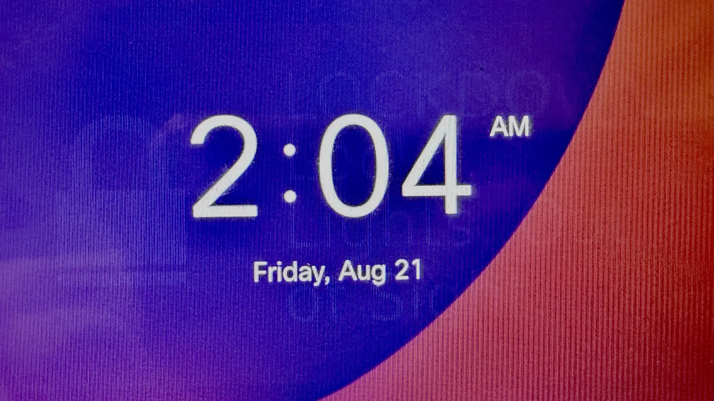

# Troubleshooting

## Common Issues

### Even though g722 is enabled, unicast/multicast broadcast audio while on speakerphone is not wideband and sounds closer to g711 and wideband works on the handset and headset

This is a known firmware bug with some 8800 series phones. There is nothing we can do about this. Cisco would need to fix this in a firmware update, which is unlikely since these phones are nearing EOL. Usually restarting the phone fixes this.

### My phone is not receiving any messages or commands from Open Paging Server and/or the phone shows as offline

This could be caused by:

- `Web Access` being disabled on the phone
- The phone being unreachable from Open Paging Server

You should:

- Ensure `Web Access` is enabled per instructions of [prerequisites](prerequisites.md)
- Ensure the phone's VLAN is accessible from Open Paging Server
- Ensure there are no firewall or switch routing rules blocking Open Paging Server from reaching the phone
  
### Open Paging Server shows the status of the phone as `No Auth URL` and broadcasts don't work

The authentication URL has not been set on the phone.

You should:

- Ensure the authentication URL is set correctly per instructions of [prerequisites](prerequisites.md)
  

### A phone receives an audio page indicated by speakers & mute light and icon on screen, but there's no audio for about 3 seconds, then the lights flash and audio begins streaming

The phone is set to multicast audio mode but the phone failed to receive the RTP stream as detected using health checks. The endpoint module detects this automatically and restarts the stream using unicast RTP as a fallback. 

If your network supports multicast, you should ensure proper IGMP rules are enabled for your network and that no firewall or routing rules are blocking IGMP. Consult your switch or router vendor's documentation or support for help.

If your network does not support multicast, or routing traffic via WAN or unicast only VPN tunnel, you should set the audio mode to unicast to speed up audio delivery and ensure the entire broadcast is heard.

### A phone receives an audio page indicated by speakers/mute light showing up, but there's no audio

Open Paging Server is able to activate the phone via CGI execute, but RTP is not reaching the phone.

You should:

- Ensure the phone's VLAN is accessible from Open Paging Server
- Ensure there are no firewall or switch routing rules blocking Open Paging Server from reaching
  
### After I close a message on a 9800 series phone, it remains partially visible over the user interface 

This is a phenomenon on many LCD screens called [image persistence](https://en.wikipedia.org/wiki/Image_persistence). It happens when a screen has displayed a static image for a long period of time. This is not an issue found on older phones, and it happens quite quickly compared to other LCD screens. So it's likely an issue with the specific vendor or a reduction in quality of the new screens. 

Unlike [screen burn-in](https://en.wikipedia.org/wiki/Screen_burn-in) found on OLED and CRT displays, image persistence is not permeant. It will disappear within half an hour. or you can refresh the screen a bunch of times to slowly clear it, such as by taking the phone off and on hook repeatedly. This happens with other UI elements too.
  
### Image is not showing on 7900 series phones or other older phones

This is a known bug, with fixes in progress.

You should:

- Ensure you are running the latest version of the module
- Wait for a update to be release to fix this
- Switch to text visual mode in the meantime while it's being fixed

