# Setting up Group Paging

In order to use Multicast RTP, Open Paging Server or Multicast Gateway connected to Open Paging Server must be on the same LAN segment. And the phone must be configured for Group Paging. Every phone on the same multicast address and port will receive the same broadcasts. You can also use separate addresses or ports to split the devices into zones or individually.

It's important to know that configuring a SPA/MPP phone to subscribe to a multicast stream will also allow outgoing multicast by dialing a code, which will bypass Open Paging Server. SPA phones expose this number on an outgoing page, while MPP phones just show `Incoming Page`. Your users should be trained to always use the correct number.

If you have not already, create a new multicast RTP endpoint in Open Paging Server. Or you can use an existing one if you want this phone on an existing group.

Open Paging Server, go to `Manage Endpoints` > `+` > `Multicast RTP`. 

Enter a name, choose an unused Multicast Address and Even Port. Leave the codec as `PMCU` unless you have a reason to use `PCMA`.

Click `Add Multicast RTP`.

## Group Paging Scripts

All SPA/MPP phones use Group Paging Scripts. they define the name, address/port, and number. Up to 10 can be defined on a single telephone. Below is an example of a paging script.

`pggrp=224.168.168.168:34560;name=All;num=800;listen=yes;`

`pggrp` defines the address and port. `name` only shows on SPA series phones. `num` defines the outgoing number for paging to this group. `listen` must be set to `yes` or else the phone won't play broadcasts. Every parameter uses `=` to define the value, and `;` between each parameter and at the end.

Change the `pggrp` to match the address and port of the multicast RTP stream.

## Default SPA series Group Paging Script

SPA series IP phones by default have `pggrp=224.168.168.168:34560;name=All;num=800;listen=yes;` configured. If you are using a SPA series phone on it's default configuration and set a multicast group for 224.168.168.168:34560, there is no further configuration required. You'll still need to configure it if your using a different address or port, your provisioning server removes this setting, if your if your using a MPP phone, or if you want to change the name or number.

## Configuring Group Paging via web interface

If you have administration access to the phone directly, you can add paging scripts via the web interface.

Go to `Admin Login` > `advanced`. under `Voice` >`Phone`. 

Ensure that under `Supplementary Services`, `Paging Serv` is set to `Yes`.

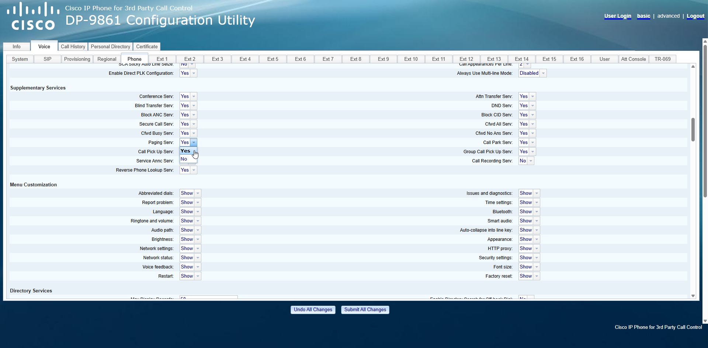

Paste your group paging script(s) under `Multiple Paging Group Parameters`  and click `Submit all changes`

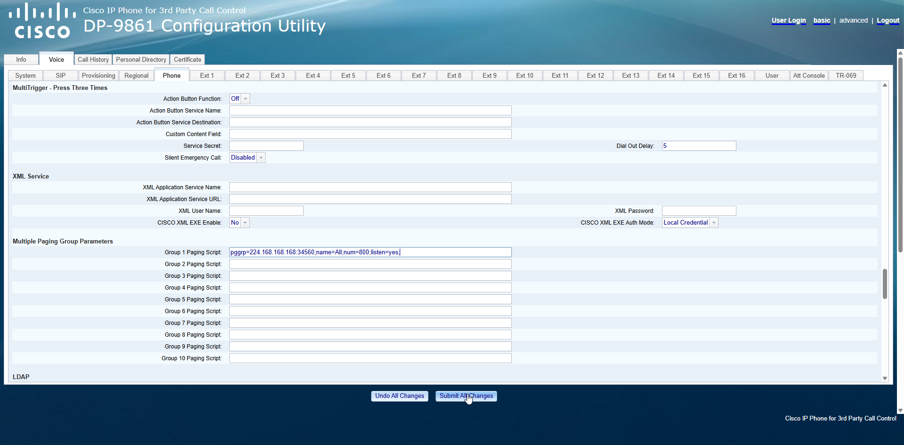
## Configuring Group Paging via Webex

For phones onboarded to Webex, you can edit the phones settings, including Group Paging Scripts via [Collaboration Control Hub](https://admin.webex.com/login). 
### Configure org-wide

Under `MANAGEMENT`, select, `Devices`.  Go to the `Settings` tab, and select `Open org-wide defaults`.

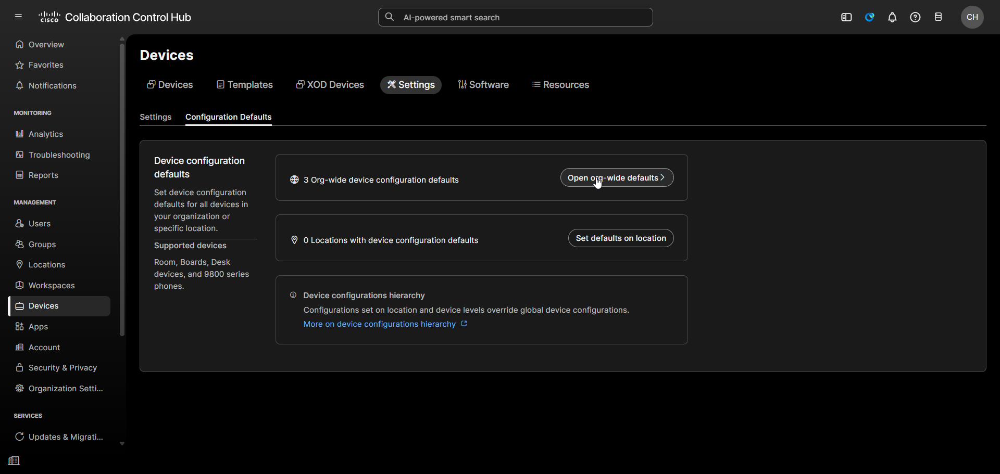

Click `Add configurations`

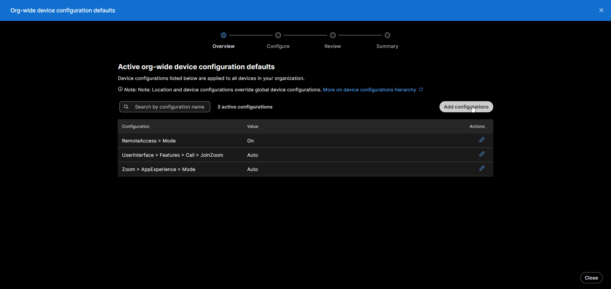

Under `Phone`, select `MulticastPagingGroup`.

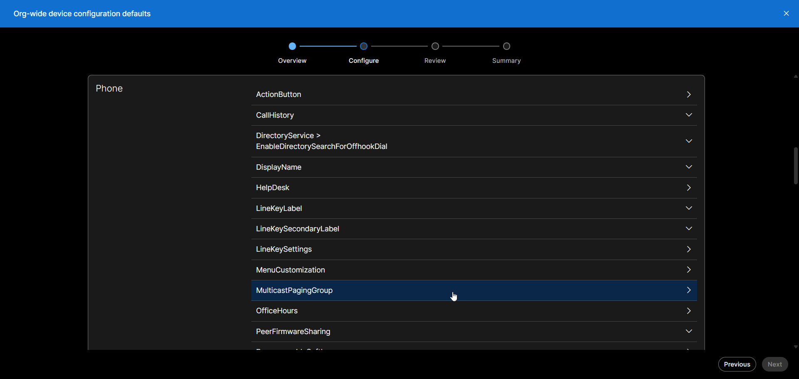

Enter your Group Paging Script(s) and click next. Since you are configuring this organization-wide, you'll need to be careful to set this correctly. If all sites are using the same address and port, you can use one just fine. If you have multiple sites with different groups or OPS clusters, you may want to use configure each individual phone or site. You can find more information below.

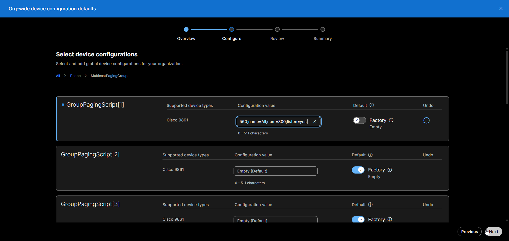

Review your change(s) and click `Apply`.

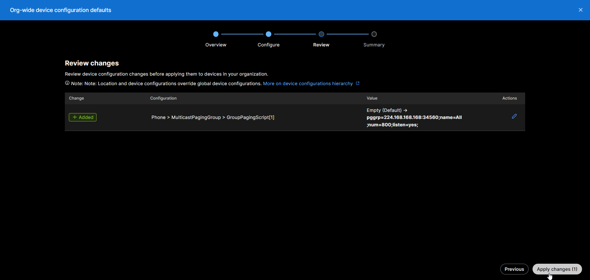

Your phone(s) will now reload and apply the new configuration.

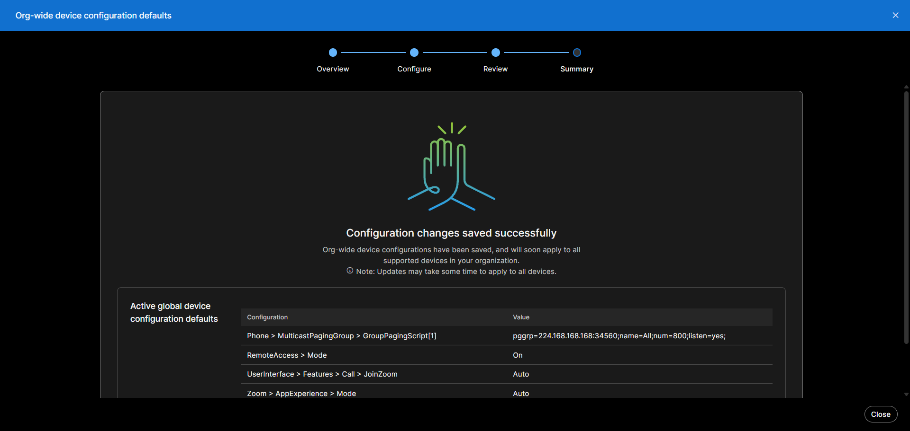

### Configure an individual locations

Under `MANAGEMENT`, select, `Devices`.  Go to the `Settings` tab, and select `Set defaults on location`. 

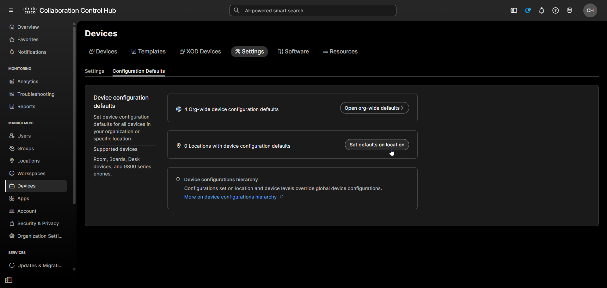

Select your location and click `Next`.

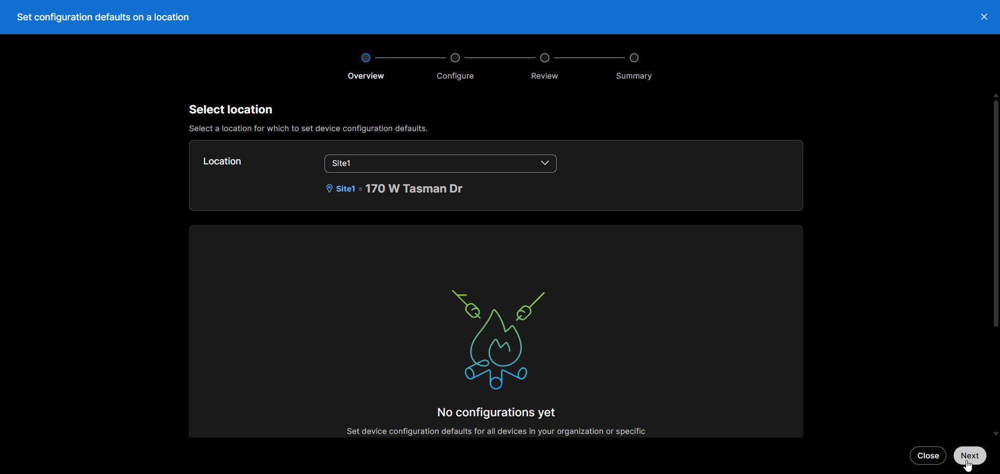

Under `Phone`, select `MulticastPagingGroup`.

Enter your Group Paging Script(s) and click next.

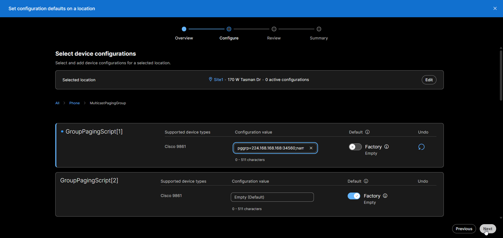

Review your change(s) and click `Apply`.

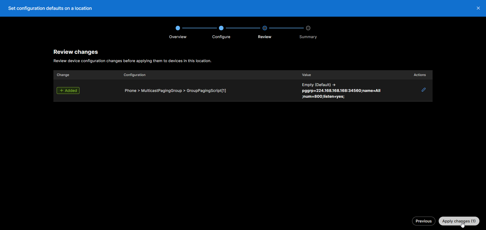

Your phone(s) will now reload and apply the new configuration.

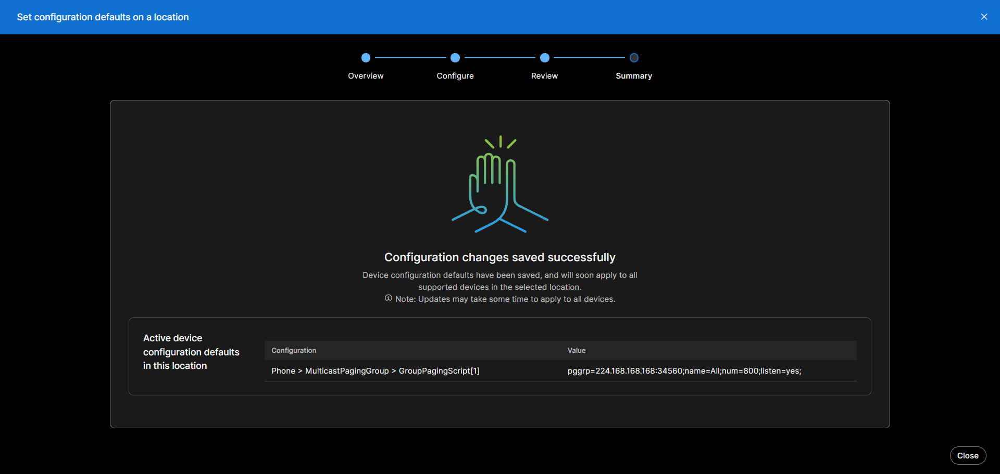
### Configure an individual phone

Under `MANAGEMENT`, select, `Devices`. Select your device, and click `All configurations`.

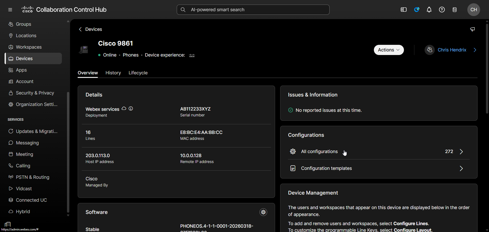

Under `Phone`, select `MulticastPagingGroup`

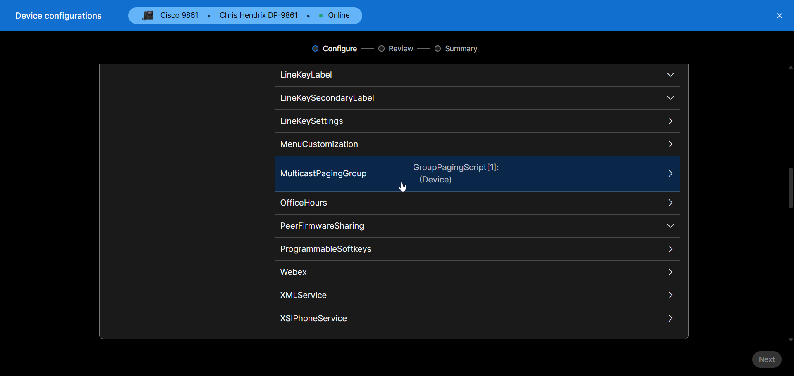

Paste your group paging script(s) and click `Next`.

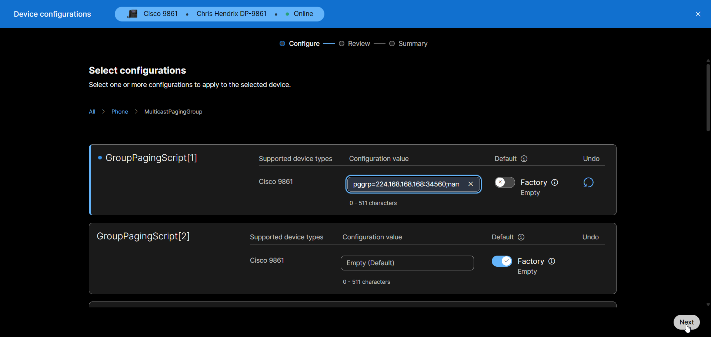

Review your change(s) and click `Apply`.

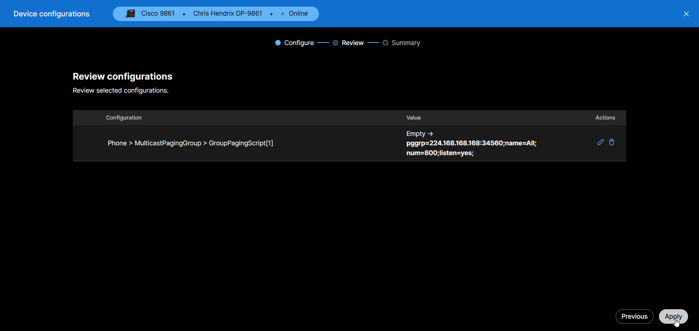

Your phone will now reload and apply the new configuration.

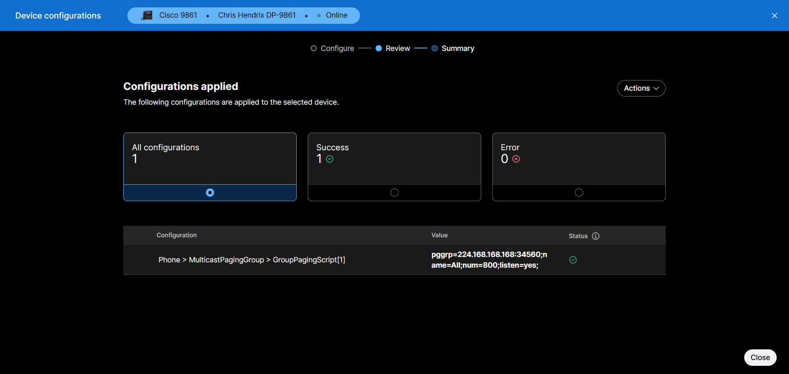

## Testing

Add the Multicast RTP endpoint into a group and page it. The device should either show the `Incoming Page` on MPP phones, or the paging group name and number on SPA phones.

If you are having issues, review the troubleshooting section.