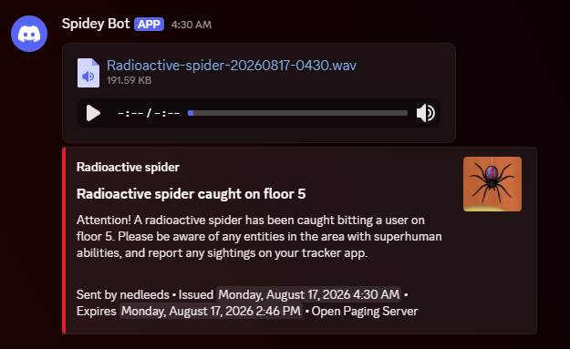

# Discord Webhooks

Using the Discord Webhooks endpoint module for Open Paging Server, you can send broadcasts to a Discord channel. Text, images and instant audio is sent as an embed. 

Common uses of this feature include notifying a Discord server of an event, and logging broadcasts and events in a Discord channel for future reference by adding the webhook as a monitor endpoint in a group(s).

/// caption
Example of a message sent directly to a webhook
///

/// caption
Example of a message sent to a group the webhook is monitoring
///
