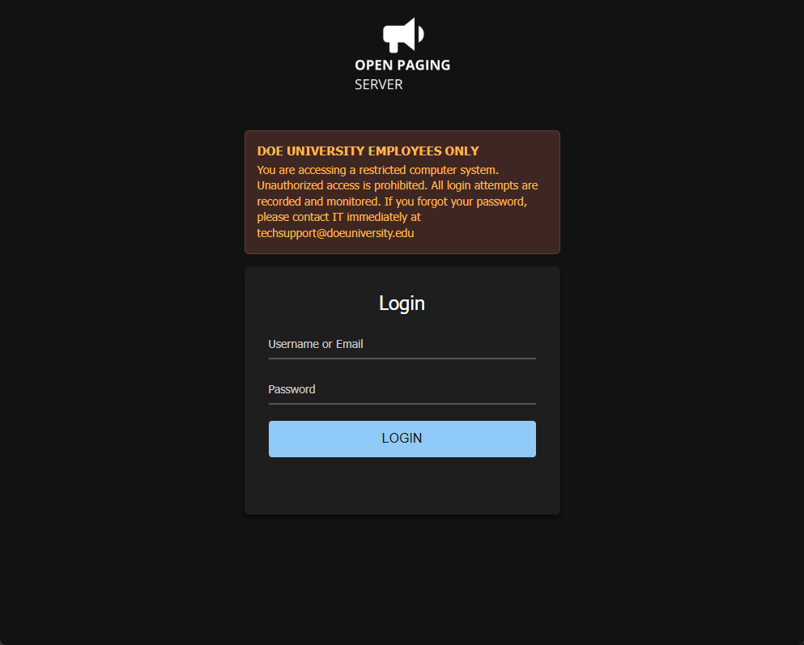
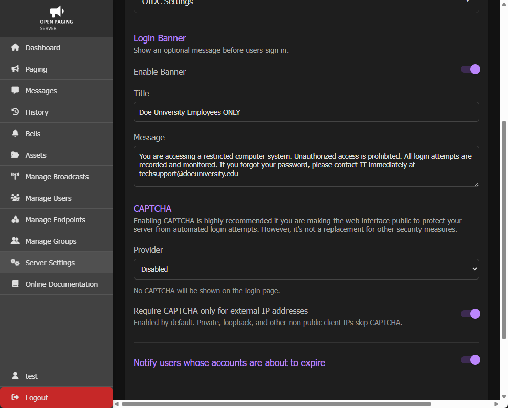

# Login Banner

You can enable a banner to show on the login page. This banner can show warnings, important information, and disclaimers user need to know about while logging in and while accessing Open Paging Server.

To change, enable, or disable the login banner, go to `System Settings` > `Login` > `Login Banner` .

The title will always show in all capitals.  If you disable the login banner, the stored title and message will be erased once you close the page.