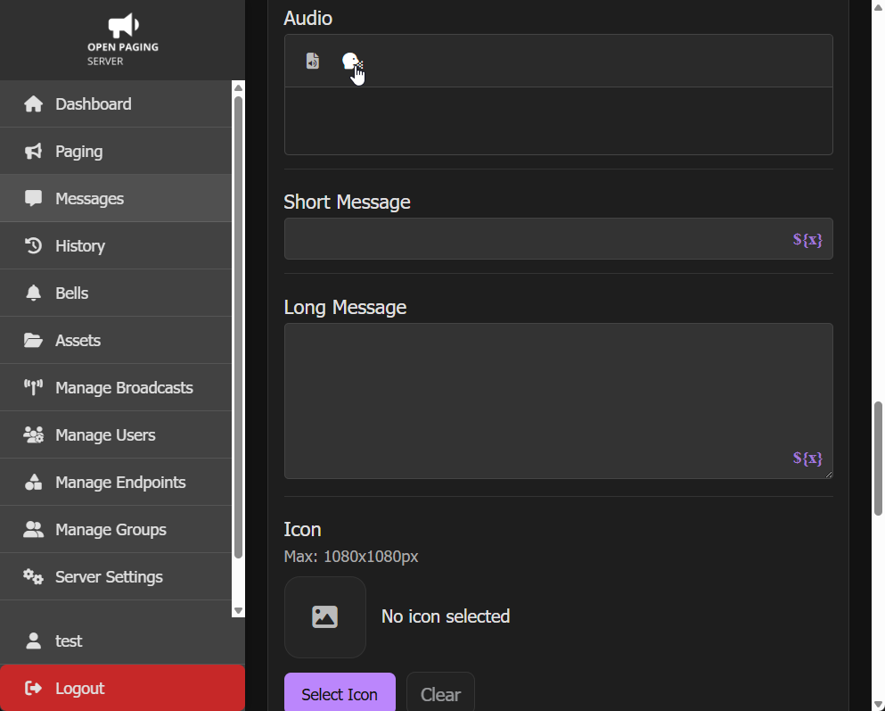
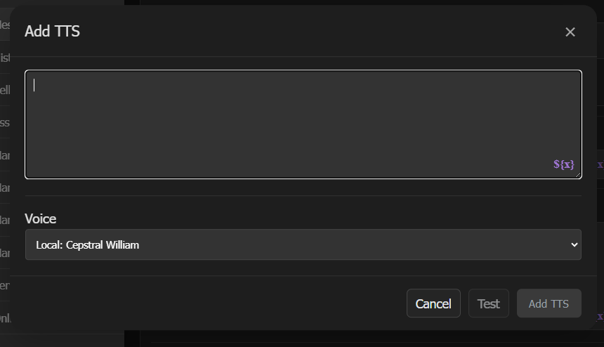
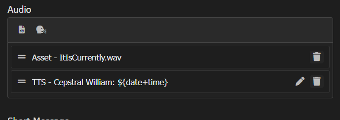

# Text to speech

You can insert text-to-speech audio in a message. The most common uses for text-to-speech is for variables and for quickly sending voice messages. 

Text-to-speech uses [Speech synthesis](https://en.wikipedia.org/wiki/Speech_synthesis) or [Deep learning speech synthesis (AI)](https://en.wikipedia.org/wiki/Deep_learning_speech_synthesis) to quickly convert written text into speech. By using text-to-speech, you can quickly send an audible message without recording. Useful for speed-critical applications.

To insert text-to-speech into the audio of a message, click the `Add TTS` button. The icon is a human head facing right with dots coming out of the mouth.

You can select a voice from the dropdown. You can also insert variables by clicking `Insert Variable` using the `${x}` icon.

Select the `Test` button for a preview of the voice. When finished, click `Add TTS`.

You can view the TTS entry in the list. Like with audio files, you can reorder it or delete it. Use the edit (pencil) button to change the text and/or voice.

## Supported TTS Engines

There are 3 factors to consider when picking a TTS engine.

1. **License**: Are you going to use a run of the mill basic free & open-source TTS engine or a luxurious $200 commercial product?
2. **Speed**: In an emergency, seconds count. While speed may not be an issue if using static TTS with caching, when tons of variables are in use, the last thing you want is an AI based engine (such as Piper), especially on a lower power box.
3. **Intelligibility**: Occupants and end users need to be able to get the message. Having messages that can't be understood can be considered to some as worse than no message. 

| Voice                                               | Type             | License     | Speed | Intelligibility | Note                                                                                                                                                                | Languages                                                                                                                                                                                                                                                                                                                                                                                                |
| --------------------------------------------------- | ---------------- | ----------- | ----- | --------------- | ------------------------------------------------------------------------------------------------------------------------------------------------------------------- | -------------------------------------------------------------------------------------------------------------------------------------------------------------------------------------------------------------------------------------------------------------------------------------------------------------------------------------------------------------------------------------------------------- |
| **[Festival](https://github.com/festvox/festival)** | Local            | Open-source | ★★★★★ | ★★⯪             | Included on all systems, installed via install script. Best for fast local TTS without commercial licenses. Lackluster intelligibility. <!-- mmmmmaaaatt -->        | English                                                                                                                                                                                                                                                                                                                                                                                                  |
| [Cepstral](https://www.cepstral.com/) (swift)       | Local            | Commercial  | ★★★★★ | ★★★★            | Recommended for high speed and satisfactory intelligibility. Expensive commercial license. Multiple voices available.                                               | English                                                                                                                                                                                                                                                                                                                                                                                                  |
| Google Translate TTS                                | Cloud (built-in) | N/A         | ★ ★   | ★★★★            | Built-in. Requires internet connection, speed may vary. Great intelligibility. Open Paging Server fallbacks to a local voice if internet connection is unavailable. | Arabic, Bengali, Chinese Simplified, Chinese Traditional, Czech, Danish, Dutch, English, English (United Kingdom), English (United States), Filipino, Finnish, French, German, Greek, Hebrew, Hindi, Hungarian, Indonesian, Italian, Japanese, Korean, Malay, Norwegian, Polish, Portuguese, Portuguese Brazil, Romanian, Russian, Spanish, Swedish, Tamil, Telugu, Thai, Turkish, Ukrainian, Vietnamese |
| [Piper](https://github.com/OHF-Voice/piper1-gpl)    | Local AI         | N/A         | ⯪     | ★★★★★           | Outstanding intelligibility. Requires powerful hardware to use. Not recommended for emergency messages due to long generation time.                              | N/A                                                                                                                                                                                                                                                                                                                                                                                                      |

