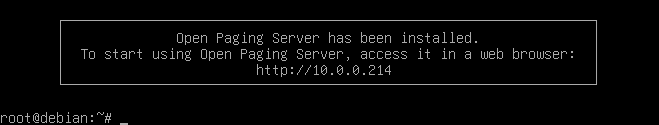
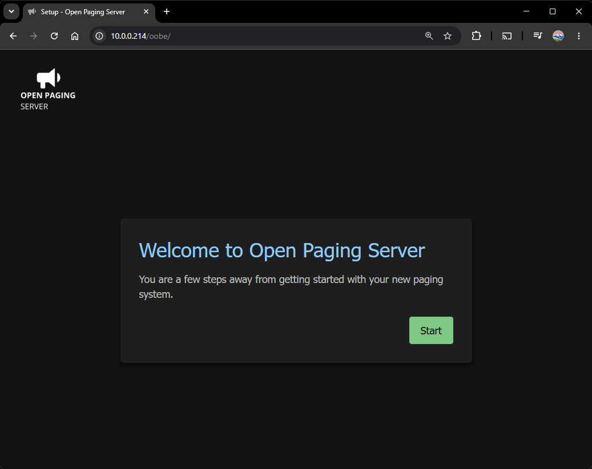
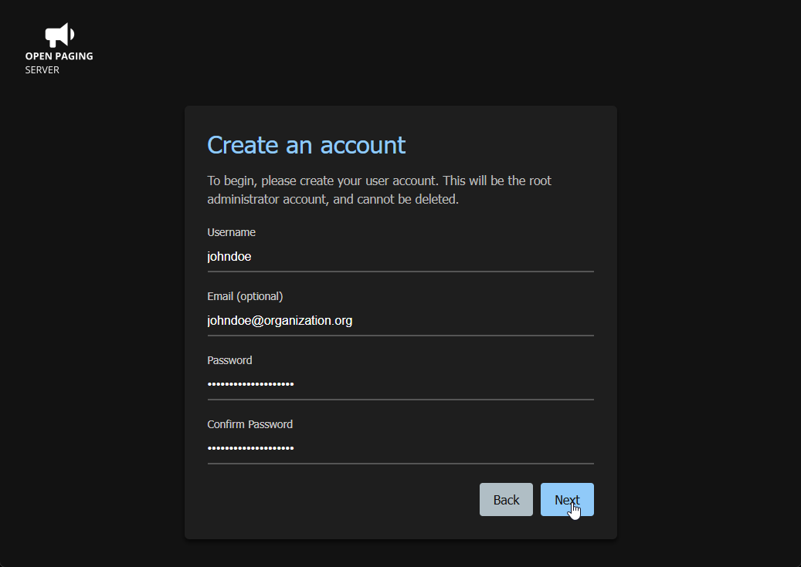
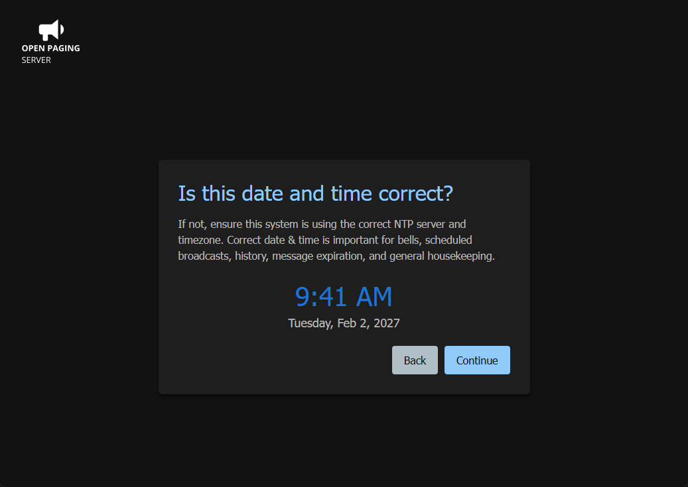
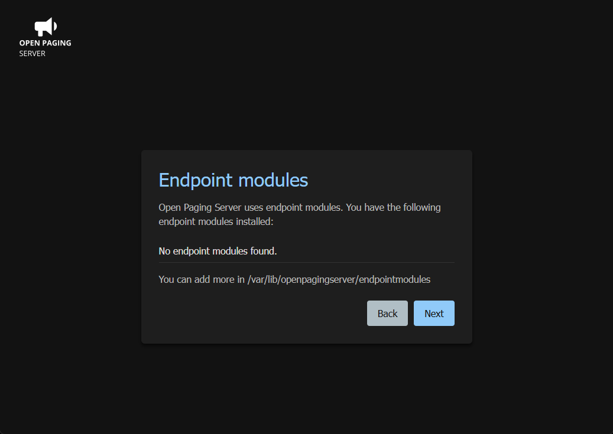
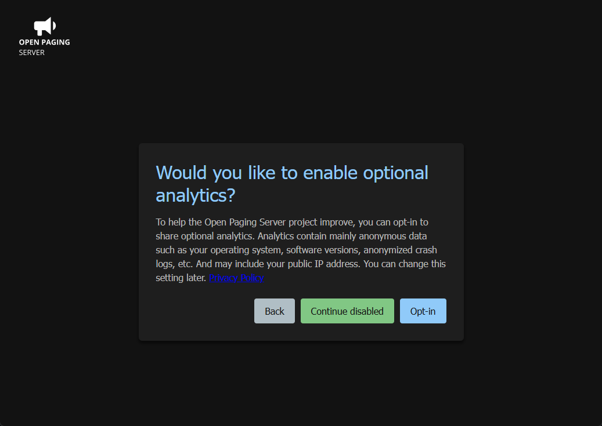
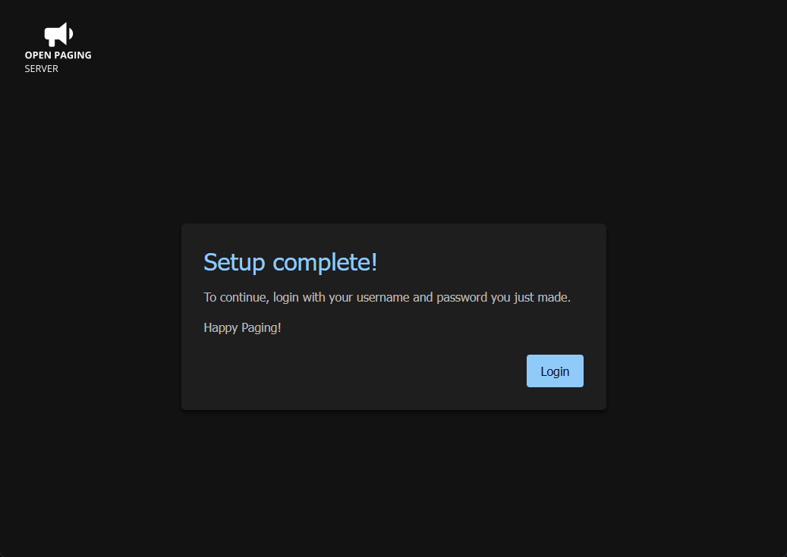
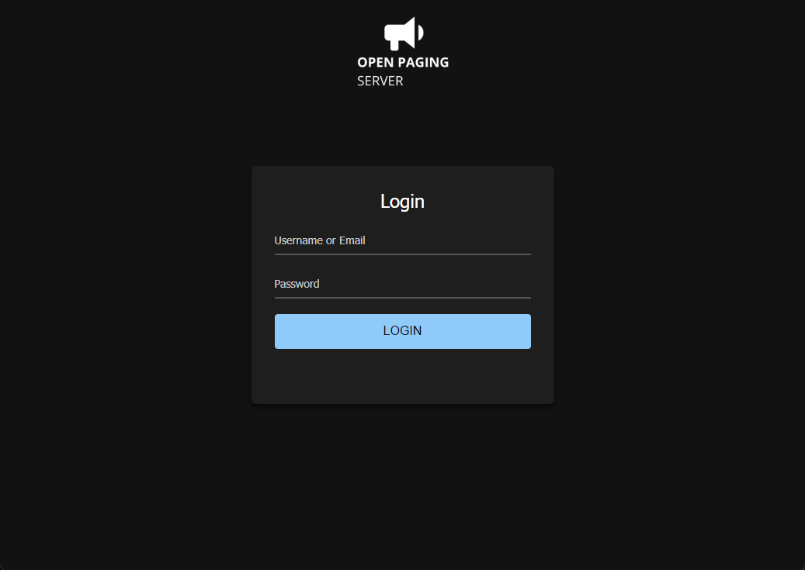

# First-time setup of Open Paging Server

???+ warning "Once you install Open Paging Server, you should start the setup process as soon as possible"
    Anybody else with access to the server via the web interface can go through the first-time setup process. Even if you don't plan to start using the server yet, you should go through the process so nobody else can claim an administrator account.

Once Open Paging Server is done installing, a message will be displayed confirming the installation completed, which will prompt you to continue at the web interface.

Go to your server in your web browser either with it's hostname/DNS name, or IP address.

You'll see the following screen if Open Paging Server was installed properly. Click `Start`.

Create an account, this will be the root administrator. So make sure the credentials are correct for your setup.

Make sure the displayed time & date is correct. If it's wrong, ensured that NTP is set correctly, your time zone is currently, or if your not using network time, reset your clock to the correct date/time. Refer to your operating system vendor for support.

A list of installed endpoint modules will be shown.

You can opt-in to optional analytics. Analytics contain mainly anonymous data such as your operating system, software versions, anonymized crash logs, etc. And may include your public IP address. Click `Contiune disabled` to leave analytics disabled. By clicking `Opt-in` to enable analytics, you agree to the [Privacy Policy](https://www.openpagingserver.org/privacypolicy/analytics). You can change this setting later.

Your account will now be created. Click `Login` and use your credentials to get started.

For documentation on configuring Open Paging Server, see Administration. For documentation on using Open Paging Server, see Users.